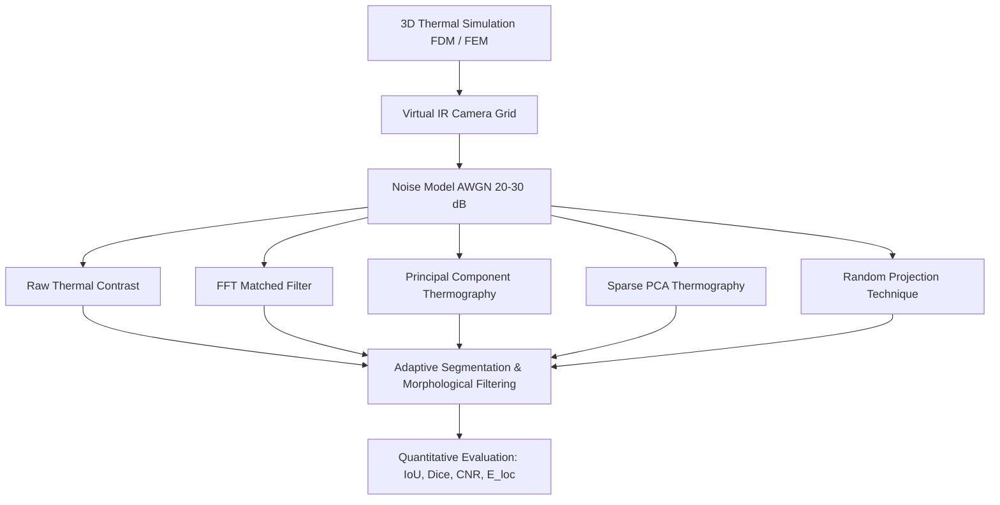

# Linear Frequency-Modulated Infrared Thermography for Subsurface Slag Inclusion Detection in Mild Steel

[](https://github.com/skmdshariff143-ai/lfmt-slag-detection/actions)
[](LICENSE)
[](https://www.python.org/)
[](app/dashboard.py)

A research-grade computational, simulation, and non-destructive testing (NDT) framework for detecting, sizing, and localizing subsurface **welding slag inclusions** in structural **mild steel plates** using **Linear Frequency-Modulated Thermography (LFMT)**.

---

## 🔬 Scientific Simulation Backend Status & Integrity

> [!IMPORTANT]
> **Honest Simulation Labeling**:
> - **Primary Forward Solver in Current Environment**: High-performance **3-Dimensional Finite Difference Method (FDM)** with vectorized Numba/NumPy stencil acceleration and harmonic interface conductivities.
> - **Finite Element Method (FEM) Status**: The architecture provides a complete modular `ThermalSimulationBackend` abstraction and weak variational formulation connector (`FEMBackend`). When FEniCSx (`dolfinx`) or SfePy is installed, it hooks directly into the FEM pipeline without modifying downstream processing.
> - To preserve research integrity, **FDM is never falsely presented or labeled as FEM**.

---

## 📐 Problem Statement & Objective

During shielded metal arc welding (SMAW) or flux-cored arc welding (FCAW) of mild steel structures, non-metallic **slag inclusions** (calcium-silicate / alumino-silicate flux residues) can become entrapped beneath the weld bead. Due to severe thermal conductivity disparity ($k_{\text{steel}} \approx 51.9\text{ W/(m}\cdot\text{K)}$ vs $k_{\text{slag}} \approx 1.20\text{ W/(m}\cdot\text{K)}$), these inclusions disrupt thermal diffusion under transient heat flux.

This project implements:
1. **3D Transient Heat Conduction**: Simulates thermal diffusion across a $100 \times 70 \times 2.3\text{ mm}$ mild steel plate containing subsurface slag inclusions (diameters $4-12\text{ mm}$, depths $0.2-1.0\text{ mm}$).
2. **LFMT Chirp Excitation**: Applies frequency-swept heat flux $f(t) = f_0 + \beta t$ ($0.05 \to 0.50\text{ Hz}$).
3. **Virtual Infrared Camera**: Projects surface thermal radiation onto configurable sensor grids ($64 \times 64$, $128 \times 128$) with realistic Additive White Gaussian Noise (AWGN, $20-30\text{ dB}$) and emissivity non-uniformities.
4. **Advanced Thermographic Signal Processing**:
   - **Raw Thermal Contrast** ($\Delta T(t)$, $C(t)$)
   - **Matched Filtering / Pulse Compression** (vectorized FFT cross-correlation)
   - **Principal Component Thermography (PCT)** (SVD / Empirical Orthogonal Functions)
   - **Sparse PCT (SPCT)** ($L_1$-penalized Sparse PCA)
   - **Random Projection Technique (RPT)** (Gaussian & Sparse Johnson-Lindenstrauss embeddings)
5. **Defect Characterization & Quantitative Metrics**: Automated adaptive Otsu segmentation, connected component analysis, sub-millimeter centroid localization ($E_{\text{loc}}$), Dice, IoU, and CNR metrics.
6. **Interactive Conference Dashboard**: Polished Streamlit instrument for single-screen conference presentation and multi-tab scientific exploration.

---

## 🏛️ System Architecture



---

## 📊 Mathematical Formulations

### 1. LFMT Chirp Waveform
$$f(t) = f_0 + \beta t, \quad \beta = \frac{f_1 - f_0}{T_{exc}}$$
$$\phi(t) = 2\pi \left(f_0 t + \frac{1}{2}\beta t^2\right)$$
$$q(t) = q_0 \cdot [1 + \sin(\phi(t))] \quad \left[\mathrm{W/m^2}\right]$$

### 2. 3D Transient Heat Diffusion
$$\rho(\mathbf{x}) C_p(\mathbf{x}) \frac{\partial T}{\partial t} = \nabla \cdot (k(\mathbf{x}) \nabla T) + Q(\mathbf{x}, t)$$
- **Heated Surface ($z=0$):** $-k \left.\frac{\partial T}{\partial z}\right|_{z=0} = q(t) - h_{conv}(T - T_{amb})$
- **Rear Surface ($z=L_z$):** $-k \left.\frac{\partial T}{\partial z}\right|_{z=L_z} = h_{conv}(T - T_{amb})$

### 3. Matched Filter Pulse Compression
$$R_{xy}(\tau) = \mathcal{F}^{-1}\{\mathcal{F}\{T_{xy}^{AC}(t)\} \cdot \mathcal{F}^*\{q_{ref}(t)\}\}$$
$$\text{Peak Map}(x, y) = \max_\tau |R_{xy}(\tau)|$$

---

## 🚀 Installation & Quick Start

### 1. Clone & Install
```bash
git clone https://github.com/skmdshariff143-ai/lfmt-slag-detection.git
cd lfmt-slag-detection
pip install -e ".[dev]"
```

### 2. Run Single Case (CLI)
```bash
python scripts/run_single_case.py --config configs/quick.yaml --save-plots
```

### 3. Launch Interactive Streamlit Conference Dashboard
```bash
streamlit run app/dashboard.py
```

### 4. Run Automated Parameter Sweep
```bash
python scripts/run_parameter_sweep.py --quick
```

### 5. Generate All 17 Publication Figures
```bash
python scripts/generate_conference_figures.py --quick
```

### 6. Run Numerical Validation Studies
```bash
python scripts/validate_mesh.py --quick
python scripts/validate_timestep.py --quick
```

---

## 📈 Performance Summary Benchmark

Representative results for $D = 8.0\text{ mm}$ slag inclusion at $z = 0.4\text{ mm}$ depth under $30\text{ dB}$ AWGN:

| Processing Method | Detected? | IoU | Dice | CNR | Loc. Error [mm] | Est. Diam [mm] | Runtime [ms] |
| :--- | :---: | :---: | :---: | :---: | :---: | :---: | :---: |
| **Raw Contrast** | NO | 0.00 | 0.00 | 0.4 | 26.33 | 11.39 | 0.4 ms |
| **Matched Filter (MF)** | **YES** | 0.44 | 0.62 | 3.6 | 2.77 | 12.92 | 2.5 ms |
| **PCT (Optimal EOF)** | **YES** | **0.53** | **0.70** | **6.0** | **0.39** | 11.79 | 3.7 ms |
| **SPCT (Sparse PCA)** | **YES** | **0.53** | **0.70** | **6.0** | **0.39** | 11.79 | 1174.9 ms |
| **RPT (Random Proj.)** | **YES** | 0.20 | 0.33 | 4.1 | 4.00 | 19.26 | 0.9 ms |

---

## 🧪 Material Database

| Material | Conductivity $k$ [W/(m·K)] | Density $\rho$ [kg/m³] | Specific Heat $C_p$ [J/(kg·K)] | Diffusivity $\alpha$ [m²/s] | Effusivity $e$ [W·s$^{1/2}$/(m²·K)] | Status |
| :--- | :---: | :---: | :---: | :---: | :---: | :---: |
| **Mild Steel (AISI 1018)** | 51.9 | 7850 | 486 | $1.36 \times 10^{-5}$ | 14,066 | Verified (Incropera) |
| **Welding Slag (Silicate)** | 1.20 | 2800 | 850 | $5.04 \times 10^{-7}$ | 1,690 | Verified (Mills 1993) |
| **Air Void / Delamination** | 0.026 | 1.161 | 1007 | $2.22 \times 10^{-5}$ | 5.5 | Verified (NIST) |
| **Stainless Steel (304)** | 14.9 | 7900 | 477 | $3.95 \times 10^{-6}$ | 7,495 | Verified (Incropera) |
| **Slag High-TiO2 Flux** | 1.45 | 2950 | 880 | $5.58 \times 10^{-7}$ | 1,940 | *Placeholder (Lab pending)* |

---

## 📦 Repository Structure

```
lfmt-slag-detection/
├── app/
│   └── dashboard.py                  # Streamlit Multi-tab & Conference Dashboard
├── src/
│   └── lfmt/
│       ├── config.py                 # Dataclasses & YAML config parser
│       ├── materials.py              # Thermophysical property database
│       ├── excitation.py             # Chirp/LFMT mathematical waveforms
│       ├── simulation/               # 3D FDM & FEM solvers
│       ├── camera.py                 # Virtual IR camera & dataset capture
│       ├── noise.py                  # AWGN & emissivity degradation models
│       ├── pulse_compression.py      # FFT matched filter cross-correlation
│       ├── pct.py                    # Principal Component Thermography (SVD)
│       ├── spct.py                   # Sparse Principal Component Thermography
│       ├── rpt.py                    # Random Projection Technique
│       ├── detection.py              # Segmentation & localization pipeline
│       ├── metrics.py                # Dice, IoU, CNR, E_loc metrics
│       ├── experiments.py            # Automated parameter sweeps & SHA caching
│       └── visualization.py          # High-DPI publication figure generation
├── matlab/                           # Academic MATLAB comparison suite
├── scripts/                          # Automated CLI execution & validation tools
├── configs/                          # default.yaml, quick.yaml, conference.yaml
├── data/                             # Dataset schemas & NPZ generation target
├── results/                          # Exported figures and CSV reports
├── tests/                            # Comprehensive unit test suite
├── docs/                             # In-depth scientific documentation
└── .github/workflows/ci.yml          # Automated CI pipeline
```

---

## 💻 MATLAB Equivalent Implementation

For academic benchmarking and cross-platform verification, a pure MATLAB implementation is available in `matlab/`:
```matlab
cd matlab
main
```
Requires MATLAB R2021a+ with Signal Processing and Image Processing Toolboxes.

---

## 🔒 Reproducibility & Security Hygiene

- Deterministic random seeds (`seed=42`) used for all noise injection and random projection matrices.
- SHA-256 simulation hashing prevents redundant runs while guaranteeing exact numerical repeatability.
- `.gitignore` strictly protects against accidental commits of secrets, large binary datasets (`.npz`, `.h5`, `.mat`), and cache files.

---

## 📄 Citation

```bibtex
@article{lfmt_slag_detection_2026,
  title={Linear Frequency-Modulated Infrared Thermography for Subsurface Slag Inclusion Detection in Mild Steel},
  author={Research Team},
  journal={IEEE Transactions on Industrial Informatics / NDT&E International},
  year={2026}
}
```

---

## 📜 License
This project is licensed under the MIT License — see the [LICENSE](LICENSE) file for details.
