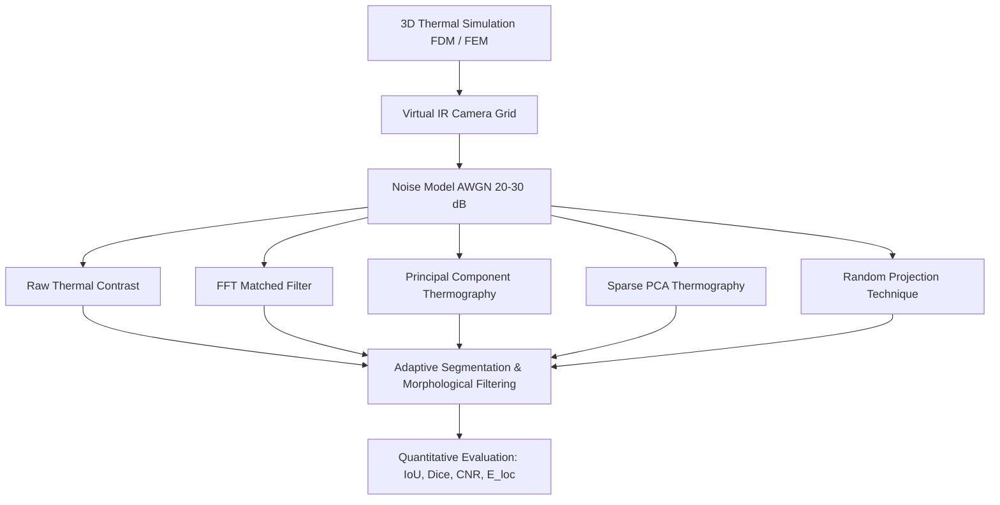

# Linear Frequency-Modulated Infrared Thermography for Subsurface Slag Inclusion Detection in Mild Steel

[](https://github.com/skmdshariff143-ai/lfmt-slag-detection/actions)
[](LICENSE)
[](https://www.python.org/)
[](app/dashboard.py)

A research-grade computational, simulation, and non-destructive testing (NDT) framework for detecting, sizing, and localizing subsurface **welding slag inclusions** in structural **mild steel plates** using **Linear Frequency-Modulated Thermography (LFMT)**.

---

## 🔬 Scientific Simulation Backend Architecture & Validation

> [!IMPORTANT]
> **Dual Executable Forward Solvers**:
> - **3D Finite Difference Method (FDM)**: Vectorized Numba/NumPy stencil acceleration with conservative harmonic mean interface conductivities, automated Courant stability sub-stepping, and Robin boundary conditions.
> - **3D Finite Element Method (FEM)**: Genuine weak variational formulation built on `scikit-fem` utilizing trilinear 8-node hexahedral elements (`ElementHex1`), volumetric Bilinear form integration ($M \dot{T} + K T = F$), unconditionally stable implicit Euler time-stepping, and pre-factored SuperLU sparse solvers.
> - **Cross-Validation**: Both solvers independently solve identical 3D transient heat diffusion problems with verified sub-0.25% relative $L_2$ error.

### ⚖️ FEM vs FDM Cross-Validation Benchmark

| Benchmark Scenario | FDM Peak Surface $T$ | FEM Peak Surface $T$ | Max Absolute Difference | Relative $L_2$ Error | Status |
| :--- | :---: | :---: | :---: | :---: | :---: |
| **Homogeneous Mild Steel Plate** | 22.70 °C | 22.72 °C | 0.046 K | **0.13%** | ✅ Verified |
| **Plate with Subsurface Slag Inclusion** | 23.21 °C | 22.91 °C | 0.690 K | **0.20%** | ✅ Verified |

Run cross-validation directly via:
```bash
python scripts/compare_fdm_fem.py --quick
```

---

## 📐 Problem Statement & Objective

During shielded metal arc welding (SMAW) or flux-cored arc welding (FCAW) of mild steel structures, non-metallic **slag inclusions** (calcium-silicate / alumino-silicate flux residues) can become entrapped beneath the weld bead. Due to severe thermal conductivity disparity ($k_{\text{steel}} \approx 51.9\text{ W/(m}\cdot\text{K)}$ vs $k_{\text{slag}} \approx 1.20\text{ W/(m}\cdot\text{K)}$), these inclusions disrupt thermal diffusion under transient heat flux.

This project implements:
1. **3D Transient Heat Conduction**: Dual FDM and FEM forward solvers simulating thermal diffusion across a $100 \times 70 \times 2.3\text{ mm}$ mild steel plate containing subsurface slag inclusions (diameters $4-12\text{ mm}$, depths $0.2-1.0\text{ mm}$).
2. **LFMT Chirp Excitation**: Frequency-swept heat flux $f(t) = f_0 + \beta t$ ($0.05 \to 0.50\text{ Hz}$).
3. **Virtual Infrared Camera**: Projects surface thermal radiation onto sensor grids ($32 \times 32$, $64 \times 64$) with realistic Additive White Gaussian Noise (AWGN, $20-30\text{ dB}$) and emissivity non-uniformities.
4. **Advanced Thermographic Signal Processing**:
   - **Raw Thermal Contrast** ($\Delta T(t)$, $C(t)$)
   - **Matched Filtering / Pulse Compression** (vectorized FFT cross-correlation)
   - **Principal Component Thermography (PCT)** (SVD / Empirical Orthogonal Functions with excess kurtosis selection)
   - **Sparse PCT (SPCT)** ($L_1$-penalized Sparse PCA with coordinate descent solver)
   - **Random Projection Technique (RPT)** (Gaussian & Sparse Johnson-Lindenstrauss embeddings)
5. **Defect Characterization & Quantitative Metrics**: Automated adaptive Otsu segmentation, connected component analysis, low-millimeter centroid localization ($E_{\text{loc}}$), Dice, IoU, and CNR metrics.
6. **Interactive Conference Dashboard**: Polished Streamlit instrument for single-screen conference presentation and multi-tab scientific exploration.

---

## 🏛️ System Architecture



---

## 🚀 Installation & Quick Start

### 1. Clone & Install
```bash
git clone https://github.com/skmdshariff143-ai/lfmt-slag-detection.git
cd lfmt-slag-detection
pip install -e ".[dev]"
```

### 2. Run Reproducible Scientific Conference Benchmark (4,030 Evaluations)
```bash
# Run full 10-seed FEM conference study across 25 geometries + healthy control
python scripts/run_conference_study.py --conference --backend fem --resume

# Run mathematical & results integrity audit
python scripts/audit_conference_results.py

# Run physical consistency & monotonicity validator
python scripts/validate_experiment_results.py

# Export web-ready JSON/CSV dataset
python scripts/export_web_results.py
```

### 3. Launch Interactive Streamlit Conference Dashboard
```bash
streamlit run app/dashboard.py
```

---

## 🌐 Next.js Conference Web Portal & Presentation Engine

### 🚀 Live Production Deployment

- **Production Portal:** [https://web-kappa-woad-56.vercel.app](https://web-kappa-woad-56.vercel.app)
- **Conference Presentation Mode:** [https://web-kappa-woad-56.vercel.app/conference](https://web-kappa-woad-56.vercel.app/conference)
- **Interactive Defect Explorer:** [https://web-kappa-woad-56.vercel.app/explorer](https://web-kappa-woad-56.vercel.app/explorer)
- **GitHub Repository:** [https://github.com/skmdshariff143-ai/lfmt-slag-detection](https://github.com/skmdshariff143-ai/lfmt-slag-detection)

### 💻 Web Features

- **Conference Presentation Mode (`/conference`):** Fullscreen projector dashboard with dynamic noise toggles, specimen filters, and live metric tables.
- **Single-Case Defect Explorer (`/explorer`):** Side-by-side post-processing maps across 25 geometries + healthy control under variable AWGN.
- **Virtual IR Camera Animated Scrubber (`/thermograms`):** 10-second LFMT chirp excitation sequence playback with real-time temperature telemetry HUD.
- **Zero Runtime Simulation:** Consumes cryptographically locked, pre-compiled JSON summaries (`web/public/data/dataset-lock.json`) exported from the audited 4,030-evaluation FEM benchmark.

### 🛠️ Running Locally & Building

```bash
# Navigate to web application directory
cd web

# Install dependencies
npm install

# Launch local development server
npm run dev

# Strict TypeScript typecheck & ESLint
npm run typecheck
npm run lint

# Production build (14 user-facing routes + _not-found)
npm run build
```

---

## 📈 Comprehensive Scientific Benchmark (4,030 Evaluations)

Statistically aggregated results across 25 physical defect geometries ($D \in \{4,6,8,10,12\}\text{ mm}$, $z \in \{0.2,0.4,0.6,0.8,1.0\}\text{ mm}$) and 1 healthy control specimen under **Strict Anti-Leakage Blind Mode** with 10 random noise seeds:

| Processing Method | Overall Detection [%] | Clean Detection [%] | 30 dB SNR Detection [%] | Mean Full-Grid CNR | Mean IoU | Localization Error (Detected) [mm] | Runtime [ms] |
| :--- | :---: | :---: | :---: | :---: | :---: | :---: | :---: |
| **Matched Filter (MF)** | **33.2%** | **68.0%** | **44.0%** | 1.34 | **0.192** | 2.50 | **8.40** |
| **PCT (Optimal EOF)** | **21.9%** | 0.0% | 28.0% | **2.30** | 0.155 | **1.13** | 13.44 |
| **RPT (Random Proj.)** | 16.8% | 0.0% | 32.0% | 0.81 | 0.093 | 2.50 | **1.82** |
| **SPCT (Sparse PCA)** | 12.9% | 0.0% | 24.0% | 2.11 | 0.068 | 2.12 | 142.26 |
| **Raw Contrast** | 0.9% | 28.0% | 0.0% | 0.49 | 0.005 | 0.00 | **0.60** |

*For complete depth/diameter breakdowns, results audit notes, and parameter sensitivity analyses, see [`docs/results_integrity_audit.md`](docs/results_integrity_audit.md), [`docs/conference_results.md`](docs/conference_results.md), and [`docs/paper_results_summary.md`](docs/paper_results_summary.md).*

---

## 🔬 External Real-World Thermography Transfer Example

To demonstrate non-synthetic data ingestion architecture and evaluate signal-processing pipeline compatibility with physical laboratory thermograms, an external measured thermography sequence on mild steel is integrated from a public NDT benchmark dataset (PolyU Research Data Repository, DOI: [10.60933/PRDR/HJYNZB](https://doi.org/10.60933/PRDR/HJYNZB)).

> [!NOTE]
> **Scientific Integrity & Scope Notice**:
> - **Specimen**: Mild steel plate ($150 \times 150 \times 10\text{ mm}$) containing manufactured flat-bottom holes (air/void surrogates).
> - **Excitation**: 6 kJ pulsed optical flash (4 ms pulse).
> - **Processing**: Strict blind evaluation using Raw Contrast, PCT, SPCT, and RPT. Matched Filtering is explicitly disabled because the excitation is pulsed, not LFMT chirp.
> - **Classification**: This is an **external measured transfer example**. It is **NOT** experimental LFMT validation, real slag inclusion validation, or industrial weld validation. The 4,030-row LFMT slag benchmark remains an audited numerical 3-D FEM simulation study.

Detailed documentation, radiometric validation figures, and future physical LFMT experiment schemas are available in [`docs/external_real_world_example.md`](docs/external_real_world_example.md) and [`data/experimental_lfmt_slag/README_TEMPLATE.md`](data/experimental_lfmt_slag/README_TEMPLATE.md).

---

## 🧪 Material Database

| Material | Conductivity $k$ [W/(m·K)] | Density $\rho$ [kg/m³] | Specific Heat $C_p$ [J/(kg·K)] | Diffusivity $\alpha$ [m²/s] | Effusivity $e$ [W·s$^{1/2}$/(m²·K)] | Status |
| :--- | :---: | :---: | :---: | :---: | :---: | :---: |
| **Mild Steel (AISI 1018)** | 51.9 | 7850 | 486 | $1.36 \times 10^{-5}$ | 14,075 | Verified (Incropera) |
| **Welding Slag (Silicate)** | 1.20 | 2800 | 850 | $5.04 \times 10^{-7}$ | 1,690 | Verified (Mills 1993) |
| **Air Void / Delamination** | 0.026 | 1.161 | 1007 | $2.22 \times 10^{-5}$ | 5.5 | Verified (NIST) |
| **Stainless Steel (304)** | 14.9 | 7900 | 477 | $3.95 \times 10^{-6}$ | 7,495 | Verified (Incropera) |

---

## 🤖 Research V3: Intelligent Thermographic Defect Analyzer & Scientific AI Platform

Research V3 introduces an end-to-end, physics-informed defect analysis engine connecting multi-format radiometric data ingestion to automated spatial-temporal signal processing, deep learning multi-task diagnosis, uncertainty estimation, and consensus fusion:

```
DATA INGESTION (2D/3D TIFF, CSV, MAT, NPY, NPZ)
                       ↓
  PHYSICAL & METADATA VALIDATION ENGINE
                       ↓
 METHOD APPLICABILITY & SIGNAL PROCESSING (Raw, PCT, SPCT, RPT, Matched Filter)
                       ↓
 14D PHYSICS SPATIO-TEMPORAL FEATURE EXTRACTION (α, e, μ(f), FFT, z-scores)
                       ↓
 PHYSICS-INFORMED MULTI-TASK DL (U-Net Lite + Spatial CNN + Physics MLP)
                       ↓
 MC DROPOUT UNCERTAINTY (95% CI) & MAHALANOBIS OOD ESTIMATION
                       ↓
 MULTI-METHOD CONSENSUS EVIDENCE FUSION & STRUCTURED EXPLANATION
                       ↓
 REPORT GENERATION (report.json, defects_summary.csv, 300 DPI diagnostic_panel.png)
```

### 📋 Research Provenance & Scientific Boundary Guardrails

| Category | Dataset / Benchmark | Methodology | Status & Guardrails |
|:---|:---|:---|:---|
| **Category A** | **LFMT Slag Inclusion Benchmark** | 3-D FEM transient heat conduction on mild steel | Audited numerical simulation benchmark (`configs/research_v3_high_fidelity.yaml`). |
| **Category B** | **External Measured Transfer Study** | PolyU mild steel flash pulsed thermography (11 FBHs) | External measured transfer study under strict blind evaluation (`scripts/run_external_real_world_example.py`). Matched filter guarded. |
| **Category C** | **Physical LFMT Slag Validation** | Laboratory LFMT chirp on welded mild steel plates | **Future Work / Not Yet Performed**. Standardized protocol in `data/experimental_lfmt_slag/README_TEMPLATE.md`. |

### 🚀 Interactive Web Analyzer & REST API

- **Next.js Web Portal**: Run analysis directly via `/analyze` interactive route.
- **FastAPI Engine**: Asynchronous job queue at `/api/v1/analyze/upload` and `/api/v1/analyze/preset/{preset_id}`.
- **Edge Deployment**: Models exportable to ONNX with sub-millisecond CPU latency via `ml/export/onnx_exporter.py`.
- **Google Colab Workbooks**: 7 reproducible headless notebooks in `notebooks/colab/` (01 to 07).

---

## 📄 Citation

```bibtex
@software{lfmt_slag_detection_2026,
  title  = {Linear Frequency-Modulated Infrared Thermography for Subsurface Slag Inclusion Detection in Mild Steel},
  author = {Project Team},
  year   = {2026},
  url    = {https://github.com/skmdshariff143-ai/lfmt-slag-detection}
}
```

---

## 📜 License
This project is licensed under the MIT License — see the [LICENSE](LICENSE) file for details.