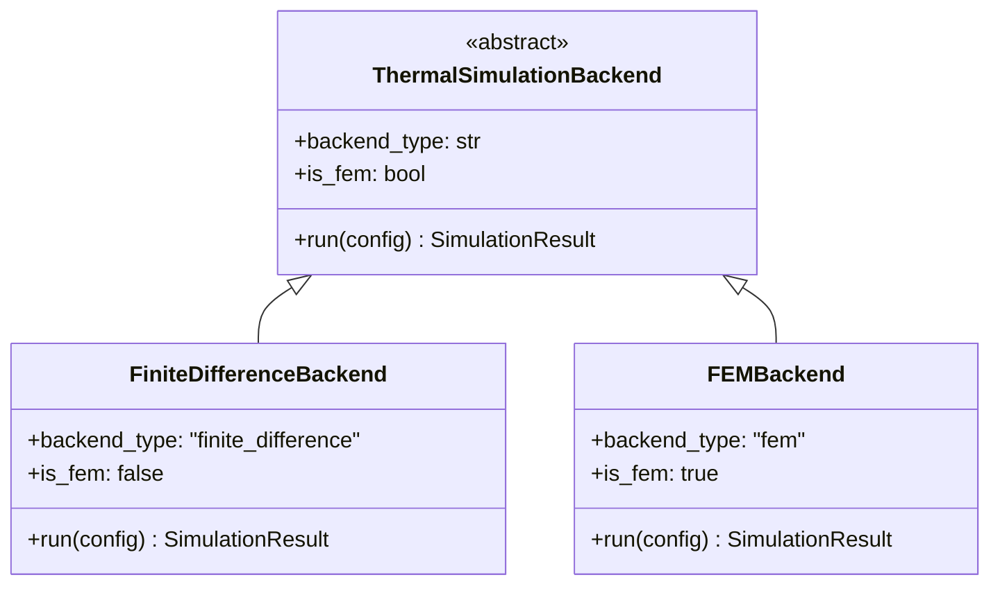
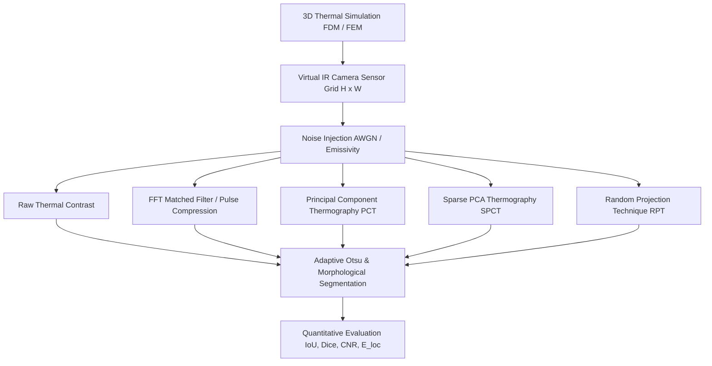

# Software Architecture & Simulation Backend Design

## Polymorphic Solver Architecture

```mermaid
classDiagram
    class ThermalSimulationBackend {
        <<abstract>>
        +backend_type: str
        +is_fem: bool
        +run(config) SimulationResult
    }
    class FiniteDifferenceBackend {
        +backend_type: "finite_difference"
        +is_fem: false
        +run(config) SimulationResult
    }
    class FEMBackend {
        +backend_type: "fem"
        +is_fem: true
        +run(config) SimulationResult
    }
    ThermalSimulationBackend <|-- FiniteDifferenceBackend
    ThermalSimulationBackend <|-- FEMBackend
```

## Processing & Evaluation Pipeline

```mermaid
graph TD
    A[3D Thermal Simulation FDM / FEM] --> B[Virtual IR Camera Sensor Grid H x W]
    B --> C[Noise Injection AWGN / Emissivity]
    C --> D1[Raw Thermal Contrast]
    C --> D2[FFT Matched Filter / Pulse Compression]
    C --> D3[Principal Component Thermography PCT]
    C --> D4[Sparse PCA Thermography SPCT]
    C --> D5[Random Projection Technique RPT]
    D1 --> E[Adaptive Otsu & Morphological Segmentation]
    D2 --> E
    D3 --> E
    D4 --> E
    D5 --> E
    E --> F[Quantitative Evaluation IoU, Dice, CNR, E_loc]
```
